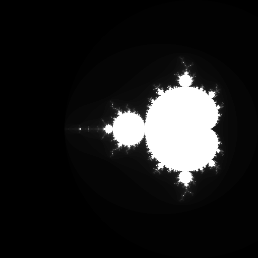
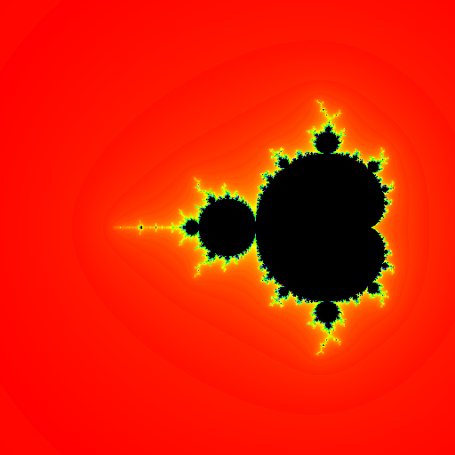
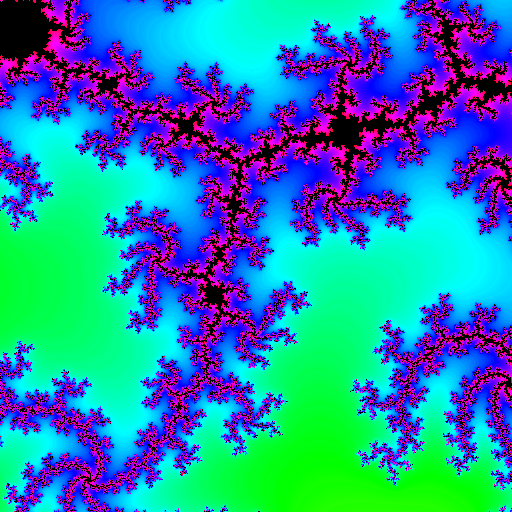
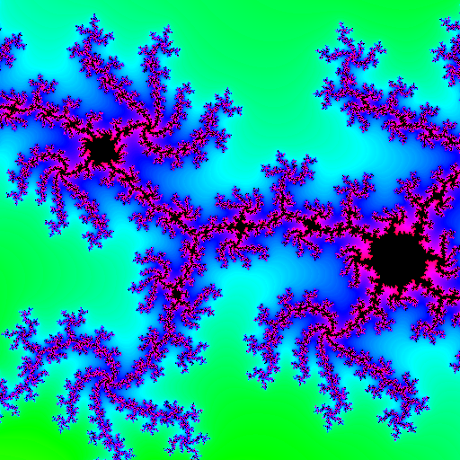

# MandelbrotSet

## Interaction

You can use WASD to shift the camera offset, and use QE to zoom in/out the camera.

Please notice that the interaction part is a quick hack that updates a fixed amount every frame, it does not take time step into account.

## References

* [Mandelbrot set wiki](https://en.wikipedia.org/wiki/Mandelbrot_set)
* https://github.com/danyshaanan/mandelbrot/blob/master/cpp/mandelbrot.cpp
* https://arukiap.github.io/fractals/2019/06/02/rendering-the-mandelbrot-set-with-shaders.html
* https://stackoverflow.com/questions/15095909/from-rgb-to-hsv-in-opengl-glsl